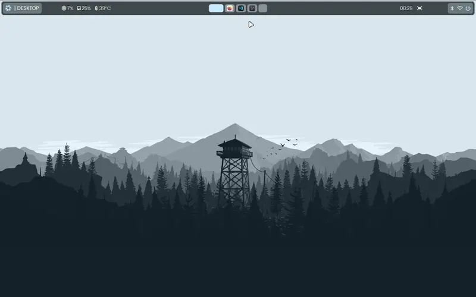

# kbyte75's Arch-Hyprland Dotfiles


## Preview



## Features

- Hyprland with Waybar, rofi, swww, matugen
- Fish shell + oh-my-posh prompt
- Pre-configured Kitty, Nautilus, nwg-look ready
- Hypremoji, hyprlock, hypridle
- Fastfetch system info

## What the script does

- Installs all required packages (pacman + AUR via yay)
- Clones and copies dotfiles to `~/.config`
- Switches default shell to Fish
- Creates necessary folders (`~/Pictures/Screenshots`, `~/Pictures/Wallpapers`)

## Requirements

- Fresh Arch Linux installation (with internet)
- Root privileges (sudo)

<!-- ## One-Command Installation (recommended)

```bash
curl -fsSL https://raw.githubusercontent.com/kbyte75/Arch-Hyprland-Config/main/install.sh | bash
```

## Manual Installation

```bash
git clone https://github.com/kbyte75/Arch-Hyprland-Config.git && cd Arch-Hyprland-Config && bash install.sh
``` -->

## INSTALLATION

1.  Update the system

```bash
sudo pacman -Syu
```

2.  Install this dependencies

```bash
sudo pacman -S --needed --noconfirm base-devel git rsync jq eog eza nano grim slurp shfmt imagemagick blueman nm-connection-editor python-pyquery adw-gtk-theme qt6-base starship xdg-desktop-portal-hyprland xdg-desktop-portal-gtk libnotify ttf-jetbrains-mono-nerd
```

3.  Install this packages

```bash
sudo pacman -S --needed --noconfirm waybar swww rofi conky hyprlock hypridle matugen fish fastfetch kitty nautilus cliphist wl-clipboard mpv nwg-look font-manager
```

3.  Setup `yay` package manager

```bash
git clone https://aur.archlinux.org/yay.git
cd yay
makepkg -si --noconfirm
```

4.  Change default shell to `fish` (optional)

```bash
command -v fish &>/dev/null && sudo chsh -s /usr/bin/fish "$USER"
```

5.  Install emoji keyboard (optional)

```bash
yay -S hypremoji --needed --noconfirm
```

6.  Install vscodium - code editor (optional) `*it's gonna take too much time`

```bash
yay -S vscodium-bin --needed --noconfirm
```

7.  Install Brave - Web Browser (optional) `Recommended`

```bash
yay -S brave-bin --needed --noconfirm
```

8.  `Clone config files (important)`

```bash
cp -a ~/.config ~/.config.bak
git clone https://github.com/kbyte75/Arch-Hyprland-Config.git
cd Arch-Hyprland-Config
cp -a * ~/.config
```

9. Set permissions

```bash
sudo chmod +x ~/.config/hypr/scripts/*.sh 2>/dev/null || true
sudo chmod +x ~/.config/waybar/scripts/*.{sh,py} 2>/dev/null || true
```

10. Download wallpapers (Optional)

```bash
mkdir -p "$HOME/Pictures/Wallpapers"
git clone https://github.com/kbyte75/wallpapers.git
cd wallpapers
mv * "$HOME/Pictures/Wallpapers"
```

11. Other tweaks (Optional)

```bash
cd Arch-Hyprland-Config
sudo rsync -a nanorc /etc
sudo sed -i.bak 's/^timeout .*/timeout 0/' /boot/loader/loader.conf
```

## After Reboot

### 1. Download Fonts, Themes, Cursor, Icon:

- [Bibata Modern Ice Cursor](https://www.gnome-look.org/p/1197198)
- [MacTahoe Icon Theme](https://www.gnome-look.org/p/2299216)
- [Rubik](https://fonts.google.com/selection?query=rubik)
- [Poppins](https://fonts.google.com/selection?query=poppins)
- [Geist Mono](https://fonts.google.com/specimen/Geist+Mono)
- [A Black Lives](https://www.dafont.com/a-black-lives.font)
- [Voice In My Head](https://www.dafont.com/voice-in-my-head.font)
- [FiraCode Nerd Font](https://github.com/ryanoasis/nerd-fonts/releases/download/v3.4.0/FiraCode.zip)

### 2. Open `nwg-look` → Set:

- Cursor: Bibata-Modern-Ice
- Icons: MacTahoe
- Fonts: Rubik / Poppins / etc.

## KEYBINDINGS

<table width="100%" style="border-collapse:collapse;font-family:sans-serif;">
  <tbody>
    <tr>
      <td style="padding:8px;border:1px solid rgba(255,255,255,.1);width:25%;">SUPER + RETURN</td>
      <td style="padding:8px;border:1px solid rgba(255,255,255,.1);width:25%;">OPEN TERMINAL (KITTY)</td>
      <td style="padding:8px;border:1px solid rgba(255,255,255,.1);width:25%;">SUPER + SHIFT + F</td>
      <td style="padding:8px;border:1px solid rgba(255,255,255,.1);width:25%;">TOGGLE FULLSCREEN</td>
    </tr>
    <tr>
      <td style="padding:8px;border:1px solid rgba(255,255,255,.1);">SUPER + D</td>
      <td style="padding:8px;border:1px solid rgba(255,255,255,.1);">CLOSE ACTIVE WINDOW</td>
      <td style="padding:8px;border:1px solid rgba(255,255,255,.1);">SUPER + SPACE</td>
      <td style="padding:8px;border:1px solid rgba(255,255,255,.1);">TOGGLE FLOATING</td>
    </tr>
    <tr>
      <td style="padding:8px;border:1px solid rgba(255,255,255,.1);">SUPER + F</td>
      <td style="padding:8px;border:1px solid rgba(255,255,255,.1);">OPEN FILE MANAGER</td>
      <td style="padding:8px;border:1px solid rgba(255,255,255,.1);">SUPER + P</td>
      <td style="padding:8px;border:1px solid rgba(255,255,255,.1);">SELECT AREA SCREENSHOT</td>
    </tr>
    <tr>
      <td style="padding:8px;border:1px solid rgba(255,255,255,.1);">SUPER + R</td>
      <td style="padding:8px;border:1px solid rgba(255,255,255,.1);">LAUNCH APP LAUNCHER</td>
      <td style="padding:8px;border:1px solid rgba(255,255,255,.1);">PRINT</td>
      <td style="padding:8px;border:1px solid rgba(255,255,255,.1);">FULL SCREENSHOT</td>
    </tr>
    <tr>
      <td style="padding:8px;border:1px solid rgba(255,255,255,.1);">SUPER + B</td>
      <td style="padding:8px;border:1px solid rgba(255,255,255,.1);">OPEN FIREFOX</td>
      <td style="padding:8px;border:1px solid rgba(255,255,255,.1);">SUPER + T</td>
      <td style="padding:8px;border:1px solid rgba(255,255,255,.1);">SWITCH WALLPAPER (RANDOM)</td>
    </tr>
    <tr>
      <td style="padding:8px;border:1px solid rgba(255,255,255,.1);">SUPER + C</td>
      <td style="padding:8px;border:1px solid rgba(255,255,255,.1);">OPEN VSCODIUM</td>
      <td style="padding:8px;border:1px solid rgba(255,255,255,.1);">SUPER + J</td>
      <td style="padding:8px;border:1px solid rgba(255,255,255,.1);">TOGGLE WAYBAR</td>
    </tr>
    <tr>
      <td style="padding:8px;border:1px solid rgba(255,255,255,.1);">SUPER + M</td>
      <td style="padding:8px;border:1px solid rgba(255,255,255,.1);">OPEN MOTRIX</td>
      <td style="padding:8px;border:1px solid rgba(255,255,255,.1);">ALT + SPACE</td>
      <td style="padding:8px;border:1px solid rgba(255,255,255,.1);">RELOAD WAYBAR</td>
    </tr>
    <tr>
      <td style="padding:8px;border:1px solid rgba(255,255,255,.1);">SUPER + W</td>
      <td style="padding:8px;border:1px solid rgba(255,255,255,.1);">OPEN WAYDROID</td>
      <td style="padding:8px;border:1px solid rgba(255,255,255,.1);">SUPER + 1–9</td>
      <td style="padding:8px;border:1px solid rgba(255,255,255,.1);">SWITCH TO WORKSPACE 1–9</td>
    </tr>
    <tr>
      <td style="padding:8px;border:1px solid rgba(255,255,255,.1);">SUPER + .</td>
      <td style="padding:8px;border:1px solid rgba(255,255,255,.1);">TOGGLE EMOJI PICKER</td>
      <td style="padding:8px;border:1px solid rgba(255,255,255,.1);">SUPER + LMB DRAG</td>
      <td style="padding:8px;border:1px solid rgba(255,255,255,.1);">MOVE WINDOW</td>
    </tr>
    <tr>
      <td style="padding:8px;border:1px solid rgba(255,255,255,.1);">SUPER + MOUSE UP / SUPER + LEFT ARROW</td>
      <td style="padding:8px;border:1px solid rgba(255,255,255,.1);">PREVIOUS WORKSPACE</td>
      <td style="padding:8px;border:1px solid rgba(255,255,255,.1);">SUPER + RMB DRAG</td>
      <td style="padding:8px;border:1px solid rgba(255,255,255,.1);">RESIZE WINDOW</td>
    </tr>
    <tr>
      <td style="padding:8px;border:1px solid rgba(255,255,255,.1);">SUPER + MOUSE DOWN / SUPER + RIFHT ARROW</td>
      <td style="padding:8px;border:1px solid rgba(255,255,255,.1);">NEXT WORKSPACE</td>
      <td style="padding:8px;border:1px solid rgba(255,255,255,.1);">ALT + MOUSE UP / ALT + LEFT ARROW</td>
      <td style="padding:8px;border:1px solid rgba(255,255,255,.1);">MOVE WINDOW TO PREVIOUS WORKSPACE</td>
    </tr>
    <tr>
      <td style="padding:8px;border:1px solid rgba(255,255,255,.1);">ALT + MOUSE DOWN / ALT + RIGHT ARROW</td>
      <td style="padding:8px;border:1px solid rgba(255,255,255,.1);">MOVE WINDOW TO NEXT WORKSPACE</td>
      <td style="padding:8px;border:1px solid rgba(255,255,255,.1);">SUPER + SHIFT + W</td>
      <td style="padding:8px;border:1px solid rgba(255,255,255,.1);">TOGGLE WALLPAPER SELECTOR</td>
    </tr>
  </tbody>
</table>

## Troubleshooting

- Script only works on Arch Linux
- Run with stable internet connection
- Reboot required after install

## Enjoy!

Your new Hyprland setup is ready. Welcome to the rice side.

Made with ❤️ by **[KBYTE75](https://github.com/kbyte75)**

<!-- COC NAME BASE LAYOUT -->
<!-- https://link.clashofclans.com/en?action=OpenLayout&id=TH14%3AHV%3AAAAAEQAAAAK__ZSkE1wWRMa-MaZ5pN8O -->
<!-- Capital Peak  -->
<!-- https://link.clashofclans.com/en?action=OpenLayout&id=TH7%3ACC%3A0%3AAAAAJAAAAAKgKJKXJSzdRDnkbqFwhY-7 -->
